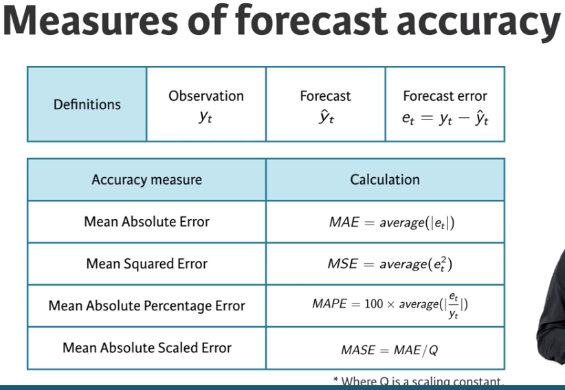
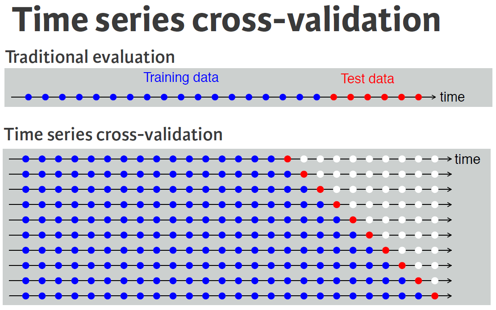
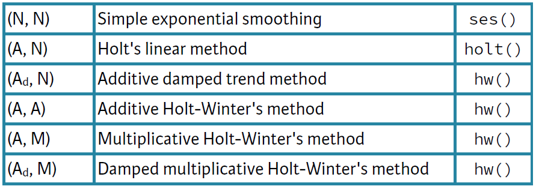

```{r}
library(fpp2, quietly = T)
```

# Exploring and visualizing time series in R

## Frequency and outliers

which.max(), can be used to identify the smallest index of the maximum value. and frequency(), used to find observations per unit time. 

## Autocorrelation of seasonal and cyclic time series

Also use function gglagplot().

```{r}
# Plot the annual sunspot numbers
autoplot(sunspot.year)
ggAcf(sunspot.year)

# Save the lag corresponding to maximum autocorrelation
maxlag_sunspot <- 1

# Plot the traffic on the Hyndsight blog
autoplot(hyndsight)
ggAcf(hyndsight)

# Save the lag corresponding to maximum autocorrelation
maxlag_hyndsight <- 7
```

## Ljung-Box test

Test all the autocorrelations together rather than consider each one separetly, so we use Ljung-Box test. It considers the first h autocrrelation values together. 

A significant test (small p-value) indicates the data are probably not white noise. 

It is very useful in order to detect if the data is white noise, a time series that is purely random. 

As you learned in the video, white noise is a term that describes purely random data. You can conduct a Ljung-Box test using the function below to confirm the randomness of a series; a p-value greater than 0.05 suggests that the data are not significantly different from white noise. Example:

```{r eval = FALSE}
googwn <- Box.test(diff(goog), lag = 25, type = "Ljung-Box")
```

# Forecast for potential futures

## Naive and snaive

```{r eval=FALSE}
# Use naive() to forecast the goog series
fcgoog <- naive(goog, h = 20)

# Plot and summarize the forecasts
autoplot(fcgoog)
summary(fcgoog)

# Use snaive() to forecast the ausbeer series
fcbeer <- snaive(ausbeer, h = 16)

# Plot and summarize the forecasts
autoplot(fcbeer)
summary(fcbeer)
```

## Fitted values and residuals

A *fitted value* is the forecast of an observation using all previous observations

* That is, they are one-step forecasts
* Often not true forecasts since parameters are estimated on all data

A *residual* is the difference between an observation and its fitted value

* That is, they are one-step forecast errors

If our forecasting method is good, the residuals should look like white noise

Essential assumptions:

* They should be uncorrelated
* They should have mean zero

Useful properties (for computing prediction intervals)

* They should have constant variance
* They should be normally distributed

We can test these assumptions using the `checkresiduals()` function.

When applying a forecasting method, it is important to always check that the residuals are well-behaved (i.e., no outliers or patterns) and resemble white noise. The prediction intervals are computed assuming that the residuals are also normally distributed. You can use the `checkresiduals()` function to verify these characteristics; it will give the results of a Ljung-Box test.

## Training and test sets

The test set must nos be used for any aspect of calculating forecasts. We will use the training set to do that. A model which fits the trining data well will not necessarily forecast well. Can ve overfitted. 

### Forecast errors

$e_t = y_t - \hat{y}_t$ is the difference between observed value and its forecast in the test set. 

There resuduals in the training set are not the same than in the testing set:

* which are errors on the training set (vs. test set)
* which are based on one-step forecasts (vs. multi_step)

Compute accuracy using forecast errors on test data.



Important information to know about these metrics:

If you want to compare between series in very different scales, you can not compare MAE or MSE because this size depends on the scale of the data 

The MAPE is better to do comparisons, but only if the data is all positive or if it has no 0 values or small values.It also assumes that there is a natural 0, so can not be used for temperature forecast.

A solution is the MASE, it's like MAE but scaled so can be compared across series. 

In all cases a small value indicates a better forecast.

We can use the `accuracy()`calculates all these metrics for us. 

## Evaluating forecast accuracy of non-seasonal methods

In data science, a training set is a data set that is used to discover possible relationships. A test set is a data set that is used to verify the strength of these potential relationships. When you separate a data set into these parts, you generally allocate more of the data for training, and less for testing.

One function that can be used to create training and test sets is `subset.ts()`, which returns a subset of a time series where the optional `start` and `end` arguments are specified using index values.

## Evaluating forecast accuracy of seasonal methods

As you learned in the first chapter, the `window()` function specifies the `start` and `end` of a time series using the relevant times rather than the index values. Either of those two arguments can be formatted as a vector like `c(year, period)` which you have also previously used as an argument for `ts()`.

## Time series cross-validation



The tsCV() function computes time series cross-validation errors. It requires you to specify the time series, the forecast method, and the forecast horizon. 

When we use the function `tsCV` we need to create out own error measures, like the following one to get the MSE: 

```{r}
e <- tsCV (oil, forecastfunction = naive, h = 1)
mean(e^2 , na.rm = TRUE)
```

Computing the mean square error for different tsCV functions, you can see that it increases with the forecast horizon: 

```{r}
sq <- function(u){u^2}
for(h in 1:10){
  oil %>% tsCV(forecastfunction = naive, h = h) %>%
    sq() %>% mean(na.rm = TRUE) %>% print()
}
```

In summary, `tsCV()` is a good tool from selecting a good forecasting model. In general, the best option is to choose the model with the smallest MSE, so compute it at the forecast horizon of most interest to you. 

# Exponentially weighted forecasts

Two different methods to do a forecast of the data: 

* naive: the most recent observation as forecast for all future periods
* mean: average of all observations as forecast for all future periods

A forecast in the middle, that take the average of all the observations but give a higher weight to the last ones, thes are teh exponential smoothing forecast. Let's see some examples:

## Simple exponential smoothing

The `ses()` function produces forecasts obtained using simple exponential smoothing (SES). The parameters are estimated using least squares estimation. All you need to specify is the time series and the forecast horizon; the default forecast time is `h = 10` years.

```{r eval=F}
args(ses)
function (y, h = 10, ...)

fc <- ses(oilprice, h = 5)

summary(fc)

autoplot(fc) + autolayer(fitted(fc))
```

You will also use `summary()` and `fitted()`, along with `autolayer()` for the first time, which is like `autoplot()` but it adds a "layer" to a plot rather than creating a new plot.

### SES vs naive 

In this exercise, you will apply your knowledge of training and test sets, the `subset.ts()` function, and the `accuracy()` function, to compare SES and naive forecasts. The process to follo is:

1. First, import and load your data. Determine how much of your data you want to allocate to training, and how much to testing; the sets should not overlap.
2. Subset the data to create a training set, which you will use as an argument in your forecasting function(s). Optionally, you can also create a test set to use later.
3. Compute forecasts of the training set using whichever forecasting function(s) you choose, and set `h` equal to the number of values you want to forecast, which is also the length of the test set.
4. To view the results, use the `accuracy()` function with the forecast as the first argument and original data (or test set) as the second.
5. Pick a measure in the output, such as RMSE or MAE, to evaluate the forecast(s); a smaller error indicates higher accuracy.

```{r eval=F}
# Create a training set using subset()
train <- subset(marathon, end = length(marathon) - 20)

# Compute SES and naive forecasts, save to fcses and fcnaive
fcses <- ses(train, h = 20)
fcnaive <- naive(train, h = 20)

# Calculate forecast accuracy measures
accuracy(fcses, marathon)
accuracy(fcnaive, marathon)

# Save the best forecasts as fcbest
fcbest <- fcnaive
```

## Exponential smoothing methods with trend

Explanation of the different parameters inside Holt's linear trend:

* forecast: the las value since the estimated value
* level: how the level changes over time as a function of the most recent observation and the previous estimate of the level
* trend: how the slope changes over time

### Holt's trend methods

Holt's local trend method is implemented in the holt() function:

```{r eval=FALSE}
holt(y, h = 10, ...)
```

## Exponential smoothing methods with trend and seasonality

This methdo is called Holt winters'. There are two versions:

*Additive method. We have to define parameters like $m$, the period seasonality (4 quarterly data), his seasonal component averages is zero
*Multiplicative method, seasonal component averages is one, also has a m parameter. 

Example: 

```{r eval=F}
aust <- window(austourists, start = 2005)
fc1 <- hw(aust, seasonal = "additive")
fc2 <- hw(aust, seasonal = "multiplicative")
```

Ther are three different giving 9 possible exponential smoothing:

* trend: None addidive od dammed
* seasonal: none, additive or multilplicative



```{r}
# Produce 3 year forecasts
fc <- hw(a10, seasonal = "multiplicative", h = 3*12)

# Check if residuals look like white noise
checkresiduals(fc)
whitenoise <- FALSE

# Plot forecasts
autoplot(fc)
```

### Holt-Winters method with daily data

The Holt-Winters method can also be used for daily type of data, where the seasonal pattern is of length 7, and the appropriate unit of time for `h` is in days.

```{r eval=F}
# Create training data with subset()
train <- subset(hyndsight, end = length(hyndsight) - 7*4)

# Holt-Winters additive forecasts as fchw
fchw <- hw(train, seasonal = "additive", h = 7*4)

# Seasonal naive forecasts as fcsn
fcsn <- snaive(train, h = 7*4)

# Find better forecasts with accuracy()
accuracy(fchw, hyndsight)
accuracy(fcsn, hyndsight)

# Plot the better forecasts based on RMSE
autoplot(fchw)
```

## State space models for exponential smoothing (ETS)

You can have two types of errors (additive or multiplicative), so the models that considers the trebd, seasonality and errors are called ETS. 

ETS models:

Parameters: estimated using the “likelihood”, the probability of the data arising from the specified model:

* For models with additive errors, this is equivalent to minimizing SSE
* Choose the best model by minimizing a corrected version of Akaike's Information Criterion (AICc)

### Automatic forecasting with exponential smoothing

The namesake function for finding errors, trend, and seasonality (ETS) provides a completely automatic way of producing forecasts for a wide range of time series.

```{r eval=F}
# Fit ETS model to austa in fitaus
fitaus <- ets(austa)

# Check residuals
checkresiduals(fitaus)

# Plot forecasts
autoplot(forecast(fitaus))

# Repeat for hyndsight data in fiths
fiths <- ets(hyndsight)
checkresiduals(fiths)
autoplot(forecast(fiths))

# Which model(s) fails test? (TRUE or FALSE)
fitausfail <- FALSE
fithsfail <- TRUE
```

### ETS vs seasonal naive

`tsCV()` must return a forecast object, so you need a function to fit a model and return forecasts:

```{r eval=F}
args(tsCV)
function (y, forecastfunction, h = 1, ...)
```


